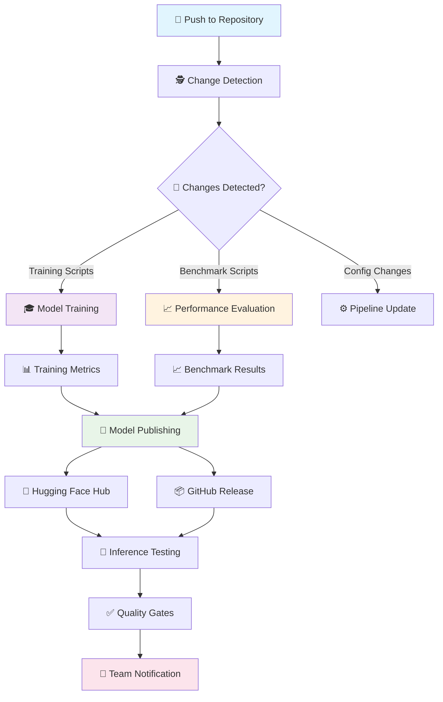

# 🤖 Meena - Enterprise AI Pipeline

#   

[](https://github.com/sheikh-vegeta/Meena/actions)
[](https://python.org)
[](https://huggingface.co)
[](https://github.com/sheikh-vegeta/Meena/blob/main/LICENSE)
[](https://github.com/sheikh-vegeta/Meena/stargazers)

<div align="center">

**🌐 An enterprise-grade CI/CD pipeline for training, benchmarking, and deploying the Meena conversational AI model**

*Designed with automation, efficiency, and multilingual support (Bengali & English) at its core*

---

> *"মানবিক সংলাপ, বাংলার ছোঁয়ায় – Building the future of multilingual conversational AI"*

</div>

## ✨ Features

🚀 **Enterprise-Ready Pipeline**
- ⚙️ **Automated CI/CD** – End-to-end automation with GitHub Actions
- 🔍 **Smart Change Detection** – Runs only the jobs affected by your commits
- 🔄 **Multi-environment Support** – Main, develop, and feature branch workflows

🧠 **Advanced AI Training**
- 🎯 **LoRA-based Fine-tuning** – Efficient training on models like DialoGPT
- 📊 **Integrated Benchmarking** – Performance evaluation with comprehensive metrics
- 🌍 **Multilingual Support** – Bengali (বাংলা) and English training datasets

📦 **Professional Deployment**
- 🤗 **Hugging Face Integration** – Automatic model publishing and versioning
- 📝 **Auto-generated Model Cards** – Detailed documentation for every model release
- 🚀 **GitHub Releases** – Automated versioning and artifact management
- 🔔 **Smart Notifications** – Keep your team updated on pipeline status

## 🛠️ Architecture Overview



## 🚀 Quick Start

### Prerequisites
```bash
# Python 3.8+ required
python --version

# Install dependencies
pip install -r requirements.txt
```

### Local Development
```bash
# Clone the repository
git clone https://github.com/sheikh-vegeta/Meena.git
cd Meena

# Set up environment
python -m venv meena-env
source meena-env/bin/activate  # On Windows: meena-env\Scripts\activate

# Install requirements
pip install -r requirements.txt

# Run training locally
python train.py

# Run benchmarking
python benchmark.py
```

## 📋 CI/CD Pipeline Details

The complete automation logic is defined in `.github/workflows/auto-train-publish.yml`

### 🎯 Trigger Conditions
- ✅ **Push to `main`** – Full pipeline execution
- ✅ **Push to `develop`** – Training and benchmarking only
- ✅ **Pull Requests** – Validation and testing
- ✅ **Manual Dispatch** – On-demand execution via GitHub Actions

### 🔄 Pipeline Jobs

| Job | Description | Triggers |
|-----|-------------|----------|
| 🕵️ **detect-changes** | Analyzes git diff to determine required pipeline stages | Always |
| 🎓 **train** | Executes model training with LoRA fine-tuning | Training scripts modified |
| 📈 **benchmark** | Runs performance evaluation and generates metrics | Model or benchmark changes |
| 🚀 **publish** | Publishes to Hugging Face Hub & creates GitHub release | Successful training completion |
| 🧪 **test** | Validates deployed model via Inference API | Post-deployment |
| 🔔 **notify** | Sends pipeline status to configured channels | Pipeline completion |

## 📊 Benchmarking & Metrics

Meena includes comprehensive evaluation metrics:

- 📈 **Perplexity Scores** – Language model quality assessment
- 🎯 **BLEU Scores** – Translation and generation quality
- 🗣️ **Conversational Metrics** – Dialogue coherence and relevance
- ⚡ **Performance Benchmarks** – Inference speed and memory usage

> *বাংলা মেট্রিক্স:* "আমাদের বেঞ্চমার্কিং সিস্টেম বাংলা ভাষার জন্য বিশেষভাবে অপ্টিমাইজ করা হয়েছে।"

## 🌍 Multilingual Support

### Bengali (বাংলা) Integration
- 📚 **Native Bengali Datasets** – Curated conversational data
- 🔤 **Proper Tokenization** – Bengali script-aware processing  
- 🎭 **Cultural Context** – Bengali idioms and expressions
- ✅ **Quality Assurance** – Bengali-specific evaluation metrics

### Training Data Structure
```
datasets/
├── bengali/
│   ├── conversations.json
│   ├── formal_dialogues.json
│   └── casual_chat.json
├── english/
│   ├── dialogpt_data.json
│   └── general_conversations.json
└── mixed/
    └── bilingual_pairs.json
```

## 🚀 Model Publishing Workflow

### Automatic Publishing
1. 🎯 **Training Completion** – Model artifacts generated
2. 📝 **Model Card Generation** – Documentation created automatically
3. 🤗 **Hugging Face Upload** – Model pushed to Hub with versioning
4. 📦 **GitHub Release** – Tagged release with artifacts
5. 🧪 **Validation Testing** – Inference API smoke tests

### Model Card Features
- 📊 **Performance Metrics** – Comprehensive benchmark results
- 🎯 **Use Cases** – Detailed application scenarios
- ⚠️ **Limitations** – Honest assessment of model boundaries
- 📜 **Training Details** – Complete training configuration
- 🌐 **Language Support** – Bengali and English capabilities

## 🛡️ Quality Assurance

### Automated Testing
- ✅ **Unit Tests** – Core functionality validation
- 🔄 **Integration Tests** – End-to-end pipeline verification
- 🧪 **Model Validation** – Output quality assessment
- 📈 **Performance Regression** – Benchmark comparison

### Code Quality
- 🔍 **Linting** – PEP 8 compliance with flake8
- 🎨 **Formatting** – Automatic formatting with black
- 📚 **Documentation** – Comprehensive docstrings
- 🔒 **Security Scanning** – Dependency vulnerability checks

## 🔔 Notification System

Stay updated with intelligent notifications:

- 📧 **Email Alerts** – Critical pipeline failures
- 💬 **Slack Integration** – Team channel updates
- 🚨 **Discord Webhooks** – Community notifications
- 📱 **GitHub Notifications** – Built-in issue tracking

## 🤝 Contributing

We welcome contributions! Please follow these guidelines:

### Development Workflow
1. 🍴 **Fork** the repository
2. 🌿 **Create** a feature branch (`git checkout -b feature/amazing-feature`)
3. ✅ **Test** your changes thoroughly
4. 📝 **Commit** with descriptive messages
5. 🚀 **Push** to your branch
6. 📬 **Open** a Pull Request

### Contribution Areas
- 🧠 **Model Improvements** – Better architectures and training techniques
- 🌐 **Language Support** – Additional language integrations
- 📊 **Benchmarking** – New evaluation metrics and datasets
- 🔧 **Infrastructure** – Pipeline optimizations and tooling
- 📚 **Documentation** – Tutorials, guides, and examples

> *অবদানকারীদের জন্য:* "আপনার অবদান বাংলা AI-এর ভবিষ্যৎ গড়তে সাহায্য করবে।"

## 📁 Repository Structure

```
Meena/
├── 📄 README.md                    # This file
├── ⚙️ requirements.txt            # Python dependencies
├── 🧪 train.py                    # Model training script
├── 📊 benchmark.py                # Performance evaluation
├── 📝 generate_model_card.py      # Documentation generation
├── 🔧 config/
│   ├── training_config.yaml       # Training parameters
│   ├── model_config.yaml          # Model architecture
│   └── benchmark_config.yaml      # Evaluation settings
├── 📚 datasets/
│   ├── bengali/                   # Bengali training data
│   ├── english/                   # English training data
│   └── mixed/                     # Bilingual datasets
├── 🎯 models/
│   ├── base/                      # Base model checkpoints
│   └── fine_tuned/               # Fine-tuned outputs
├── 📈 benchmarks/
│   ├── results/                   # Benchmark outputs
│   └── metrics/                  # Performance data
└── 🔄 .github/
    └── workflows/
        └── auto-train-publish.yml # CI/CD pipeline
```

## 📜 License

This project is licensed under the **Apache License 2.0** - see the [LICENSE](LICENSE) file for details.

## 🌟 Acknowledgments

- 🤗 **Hugging Face** – For the incredible transformers library and model hub
- 🧠 **OpenAI** – For inspiring conversational AI research
- 🌐 **Bengali NLP Community** – For dataset contributions and feedback
- 👥 **Contributors** – Everyone who has helped improve Meena

## 📞 Support & Contact

- 📧 **Issues**: [GitHub Issues](https://github.com/sheikh-vegeta/Meena/issues)
- 💬 **Discussions**: [GitHub Discussions](https://github.com/sheikh-vegeta/Meena/discussions)
- 🌐 **Documentation**: [Wiki](https://github.com/sheikh-vegeta/Meena/wiki)

---

<div align="center">

**🔮 Building the Future of Multilingual Conversational AI**

*Made with ❤️ by the Meena Team*

**[⭐ Star this repo](https://github.com/sheikh-vegeta/Meena) if you found it helpful!**

</div>
