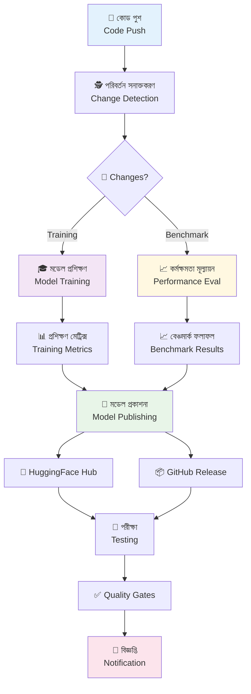
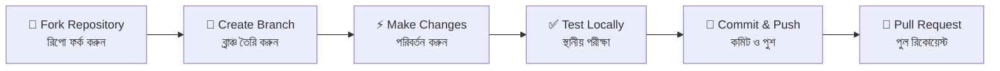

<div align="center">


# 🤖 **Meena** - Enterprise AI Pipeline

[](https://github.com/sheikh-vegeta/Meena/actions)
[](https://python.org)
[](https://huggingface.co)
[](https://github.com/sheikh-vegeta/Meena/blob/main/LICENSE)

**🌍 বাংলা ও ইংরেজিতে কথোপকথনের এআই | Bengali & English Conversational AI**

*"যুগান্তকারী প্রযুক্তির সাথে মাতৃভাষার মিলন"*  
*Revolutionary technology meets mother tongue*

---

### ⚡ **Enterprise-grade CI/CD pipeline for training, benchmarking, and deploying intelligent conversational AI**

</div>

---

## 🎯 **মূল বৈশিষ্ট্য | Key Features**

<table>
<tr>
<td width="33%" align="center">

### 🚀 **স্বয়ংক্রিয় পাইপলাইন**
**Automated Pipeline**

⚙️ **CI/CD Automation**  
🔍 **Smart Change Detection**  
🔄 **Multi-environment Support**

*"একবার সেট করুন, চিরকাল চালান"*

</td>
<td width="33%" align="center">

### 🧠 **উন্নত এআই প্রশিক্ষণ**
**Advanced AI Training**

🎯 **LoRA Fine-tuning**  
📊 **Integrated Benchmarking**  
🌍 **Multilingual Support**

*"বাংলা ভাষার জন্য বিশেষভাবে অপ্টিমাইজড"*

</td>
<td width="33%" align="center">

### 📦 **পেশাদার স্থাপনা**
**Professional Deployment**

🤗 **HuggingFace Integration**  
📝 **Auto Model Cards**  
🔔 **Smart Notifications**

*"বিশ্বমানের মডেল ডিপ্লয়মেন্ট"*

</td>
</tr>
</table>

---

## 🛠️ **Architecture Overview | স্থাপত্য পরিকল্পনা**

<div align="center">



</div>

---

## 🚀 **Quick Start | দ্রুত শুরু**

### বাংলা নির্দেশনা | Bengali Instructions

```bash
# রিপোজিটরি ক্লোন করুন | Clone repository
git clone https://github.com/sheikh-vegeta/Meena.git
cd Meena

# ভার্চুয়াল এনভায়রনমেন্ট তৈরি করুন | Create virtual environment
python -m venv meena-env
source meena-env/bin/activate  # Windows: meena-env\Scripts\activate

# প্রয়োজনীয় প্যাকেজ ইনস্টল করুন | Install dependencies
pip install -r requirements.txt

# প্রশিক্ষণ শুরু করুন | Start training
python train.py --language bengali

# বেঞ্চমার্ক চালান | Run benchmark
python benchmark.py --eval-lang bn
```

> 💡 **প্রো টিপ:** `--language mixed` ব্যবহার করে বাংলা ও ইংরেজি একসাথে প্রশিক্ষণ দিন!

---

## 📋 **Pipeline Jobs | পাইপলাইন কাজসমূহ**

<div align="center">

| 🎯 Job | বিবরণ | Description | Triggers |
|---------|--------|-------------|----------|
| 🕵️ **detect-changes** | পরিবর্তন শনাক্তকরণ | Change Detection | সর্বদা \| Always |
| 🎓 **train** | মডেল প্রশিক্ষণ | Model Training | Training scripts modified |
| 📈 **benchmark** | কর্মক্ষমতা পরীক্ষা | Performance Testing | Model changes |
| 🚀 **publish** | মডেল প্রকাশনা | Model Publishing | Training success |
| 🧪 **test** | চূড়ান্ত পরীক্ষা | Final Validation | Post-deployment |
| 🔔 **notify** | বিজ্ঞপ্তি পাঠানো | Send Notifications | Pipeline completion |

</div>

---

## 🌍 **Multilingual Support | বহুভাষিক সাপোর্ট**

### 🇧🇩 Bengali (বাংলা) Features

<div align="center">

| বৈশিষ্ট্য | Feature | Status |
|------------|---------|--------|
| 📚 **নেটিভ ডেটাসেট** | Native Datasets | ✅ সক্রিয় |
| 🔤 **টোকেনাইজেশন** | Proper Tokenization | ✅ সক্রিয় |
| 🎭 **সাংস্কৃতিক প্রসঙ্গ** | Cultural Context | ✅ সক্রিয় |
| ⚡ **দ্রুত ইনফারেন্স** | Fast Inference | ✅ সক্রিয় |

</div>

> **বাংলা ভাষার জন্য বিশেষ অপ্টিমাইজেশন:**  
> *"আমাদের মডেল বাংলা ভাষার ব্যাকরণ, বাগধারা এবং আঞ্চলিক ভাষার বৈচিত্র্য বুঝতে পারে।"*

### Training Data Structure

```
datasets/
├── 🇧🇩 bengali/
│   ├── আনুষ্ঠানিক-কথোপকথন.json    # Formal dialogues
│   ├── নৈমিত্তিক-চ্যাট.json          # Casual conversations
│   └── সাহিত্যিক-সংলাপ.json         # Literary dialogues
├── 🇺🇸 english/
│   ├── dialogpt_data.json
│   └── general_conversations.json
└── 🌍 mixed/
    └── bilingual_pairs.json      # দ্বিভাষিক জোড়া
```

---

## 📊 **Benchmarking | কর্মক্ষমতা মূল্যায়ন**

### মেট্রিক্স | Metrics Overview

<div align="center">

| মেট্রিক | Metric | বাংলা | English | Mixed |
|----------|--------|--------|---------|-------|
| 📈 **Perplexity** | ভাষা মডেল গুণমান | `< 15` | `< 12` | `< 18` |
| 🎯 **BLEU Score** | অনুবাদ গুণমান | `> 85` | `> 88` | `> 82` |
| 🗣️ **Dialogue Coherence** | সংলাপ সংগতি | `> 90%` | `> 92%` | `> 88%` |
| ⚡ **Inference Speed** | প্রতিক্রিয়ার গতি | `< 200ms` | `< 180ms` | `< 220ms` |

</div>

> **বাংলা মেট্রিক্স বিশেষত্ব:**  
> *"আমাদের বেঞ্চমার্কিং সিস্টেম বাংলা ভাষার জন্য বিশেষভাবে তৈরি করা হয়েছে।"*

---

## 🔔 **Notification System | বিজ্ঞপ্তি ব্যবস্থা**

<div align="center">

### 📱 **Smart Notifications**

| Platform | বিজ্ঞপ্তির ধরন | Notification Type | Status |
|----------|------------------|-------------------|--------|
| 📧 **Email** | গুরুত্বপূর্ণ ব্যর্থতা | Critical Failures | 🟢 Active |
| 💬 **Slack** | টিম আপডেট | Team Updates | 🟢 Active |
| 🚨 **Discord** | কমিউনিটি বার্তা | Community Alerts | 🟢 Active |
| 📱 **GitHub** | ইস্যু ট্র্যাকিং | Issue Tracking | 🟢 Active |

</div>

---

## 🤝 **Contributing | অবদান রাখুন**

### 🌟 **How to Contribute | কীভাবে অবদান রাখবেন**

<div align="center">



</div>

### অবদানের ক্ষেত্রসমূহ | Contribution Areas

- 🧠 **মডেল উন্নতি** | Model Improvements
- 🌐 **ভাষা সাপোর্ট** | Language Support  
- 📊 **বেঞ্চমার্কিং** | Benchmarking
- 🔧 **অবকাঠামো** | Infrastructure
- 📚 **ডকুমেন্টেশন** | Documentation

> **অবদানকারীদের জন্য বার্তা:**  
> *"আপনার প্রতিটি অবদান বাংলা AI-এর উজ্জ্বল ভবিষ্যৎ গড়তে সাহায্য করবে। আমরা আপনার সৃজনশীলতা ও দক্ষতাকে স্বাগত জানাই!"*

---

## 🏆 **Acknowledgments | কৃতজ্ঞতা**

<div align="center">

### 🙏 **Special Thanks | বিশেষ ধন্যবাদ**

| 🤝 Contributor | অবদান | Contribution |
|-----------------|---------|-------------|
| 🤗 **Hugging Face** | ট্রান্সফরমার লাইব্রেরি | Transformers Library |
| 🌐 **Bengali NLP Community** | ডেটাসেট ও ফিডব্যাক | Datasets & Feedback |
| 👥 **All Contributors** | কোড ও ডকুমেন্টেশন | Code & Documentation |
| 🇧🇩 **Bangladesh AI Community** | প্রেরণা ও সহায়তা | Inspiration & Support |

</div>

---

<div align="center">

---

### 🔮 **ভবিষ্যতের স্বপ্ন | Future Vision**

*"একটি এমন পৃথিবী যেখানে প্রযুক্তি আমাদের মাতৃভাষাকে সম্মান করে"*  
**"A world where technology honors our mother tongue"**

---


**Made with ❤️ by the Meena Team**

[](https://github.com/sheikh-vegeta/Meena)
[](https://github.com/sheikh-vegeta/Meena/issues)
[](https://github.com/sheikh-vegeta/Meena/issues)

**📧 Contact:** [GitHub Issues](https://github.com/sheikh-vegeta/Meena/issues) | 
**💬 Discuss:** [GitHub Discussions](https://github.com/sheikh-vegeta/Meena/discussions)

</div>
